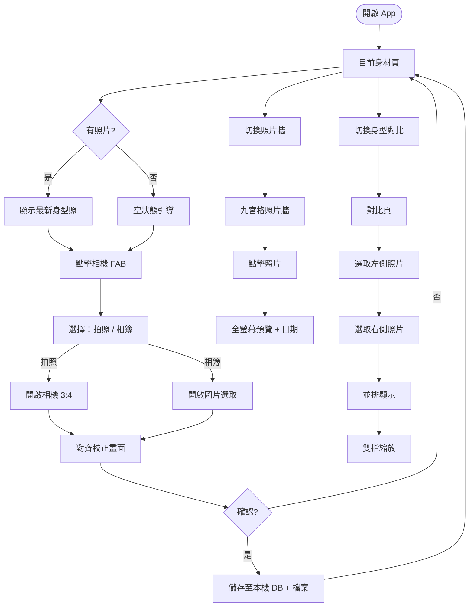

# SPARKSHAPE — Body Tracking App

**Status**: Complete  
**Date**: 2026-05-31  
**Tech**: React Native 0.81.5 + Expo SDK ~54 + TypeScript ~5.9.2  
**Platform**: Android & iOS

---

## Business Context

健身、減重、增肌的使用者需要一個隱私優先的身型追蹤工具，讓他們能以一致的拍攝方式（3:4 直式 + 人形輪廓對齊）記錄身材變化，並透過九宮格照片牆和前後對比功能直觀感受進步。

所有照片與資料儲存於本機，不上傳至任何第三方伺服器。

---

## User Stories

| # | As a | I want | So that |
|---|------|--------|---------|
| US1 | 使用者 | 用相機或相簿拍攝一張 3:4 身型照 | 我能留下今日的身材紀錄 |
| US2 | 使用者 | 對齊人形輪廓後儲存照片 | 每次拍攝取景一致，方便日後比較 |
| US3 | 使用者 | 在九宮格照片牆瀏覽所有歷史照片 | 一眼看出身材隨時間的變化趨勢 |
| US4 | 使用者 | 任意選取兩個時間點的照片做前後對比 | 我能量化感受身材進步的幅度 |
| US5 | 使用者 | 對對比照片雙指縮放 | 我能仔細觀察局部細節 |
| US6 | 使用者 | 首次使用時清楚了解需要的系統權限 | 我能放心授予相機與相簿存取權 |

---

## Acceptance Criteria

```gherkin
Scenario: 拍攝並儲存身型照
  Given 使用者在「目前身材」頁
  When 點擊右下角相機 FAB
  And 選擇「拍照」並完成拍攝（3:4 比例）
  And 在對齊畫面調整位置後點擊「確認」
  Then 照片儲存至本機
  And 「目前身材」頁更新顯示最新照片

Scenario: 上傳相簿照片
  Given 使用者在「目前身材」頁
  When 點擊相機 FAB，選擇「從相簿選取」
  And 選取一張照片並在對齊畫面確認
  Then 照片儲存至本機，頁面更新

Scenario: 照片牆顯示歷史紀錄
  Given 使用者已有多張身型照
  When 切換到「照片牆」分頁
  Then 以九宮格展示所有照片（最新在前）
  And 點擊任一張可放大預覽並顯示日期

Scenario: 前後對比
  Given 使用者在「身型對比」頁
  When 點擊「選擇照片」並從清單選取兩張不同日期的照片
  Then 左右並排展示兩張照片
  And 顯示各自日期與時間差
  And 可用雙指捏合縮放

Scenario: 首次啟動權限請求
  Given 使用者首次使用 App
  When App 啟動後觸發相機或相簿功能
  Then 顯示系統權限請求
  And 若拒絕，顯示引導說明
```

---

## User Journey



---

## Scope

**In Scope (MVP)**:
- 三分頁 App（目前身材、照片牆、身型對比）
- 相機拍照（3:4）+ 相簿上傳
- 人形輪廓對齊校正畫面
- 照片多尺寸儲存（thumb / grid / detail / full）
- SQLite metadata 記錄
- 九宮格照片牆 + 放大預覽
- 前後對比 + 雙指縮放
- 本機儲存（無雲端）
- 相機/相簿權限處理

**Out of Scope (MVP)**:
- 體重/BMI/體脂率數據記錄
- 社群分享功能
- 雲端備份/多裝置同步
- AI 體型分析

---

## Implementation Plan

### Phase 0 — 專案初始化

- [ ] `npx create-expo-app@latest SPARKSHAPE --template blank-typescript`
- [ ] 安裝所有套件（見 README.md 完整清單）
- [ ] 設定 `app.json`（portrait、newArchEnabled、typedRoutes）
- [ ] 設定 `tsconfig.json`（strict、`@/*` 別名）
- [ ] 設定 `babel.config.js`（babel-preset-expo）
- [ ] `app/_layout.tsx`：`GestureHandlerRootView` + `DBProvider`
- [ ] 驗證：`npx expo start --clear` 可執行

### Phase 1 — 資料層（TDD）

- [ ] **Task 1.1** `src/types/bodyPhoto.ts` + `src/constants/db.ts`
- [ ] **Task 1.1** `src/services/bodyPhotoService.ts`（CRUD 純函式）
- [ ] **Task 1.1** `src/__tests__/services/bodyPhotoService.test.ts`
- [ ] **Task 1.2** `src/services/photoStorageService.ts`（多尺寸壓縮）
- [ ] **Task 1.2** `src/constants/photo.ts`（PHOTO_SIZES）
- [ ] **Task 1.2** `src/__tests__/services/photoStorageService.test.ts`
- [ ] **Task 1.3** `src/providers/DBProvider.tsx`
- [ ] **Task 1.3** `src/hooks/useBodyPhotos.ts`
- [ ] **Task 1.3** `src/__tests__/hooks/useBodyPhotos.test.ts`

### Phase 2 — 導覽 Shell

- [ ] `app/_layout.tsx`（Root Layout）
- [ ] `app/(tabs)/_layout.tsx`（三分頁 Tab）
- [ ] `app/(tabs)/current.tsx`（placeholder）
- [ ] `app/(tabs)/wall.tsx`（placeholder）
- [ ] `app/(tabs)/comparison.tsx`（placeholder）

### Phase 3 — 目前身材頁

- [ ] `src/components/SilhouetteOverlay.tsx`
- [ ] `src/components/AlignScreen.tsx`（Pan + Pinch 對齊）
- [ ] `src/components/CameraSheet.tsx`（FAB → Sheet → Camera/Picker）
- [ ] `app/(tabs)/current.tsx`（完整實作）
- [ ] `__mocks__/expo-camera.ts`、`expo-image-picker.ts`

### Phase 4 — 照片牆頁

- [ ] `src/components/BodyPhotoCard.tsx`
- [ ] `src/components/PhotoPreviewModal.tsx`
- [ ] `app/(tabs)/wall.tsx`（FlashList 九宮格）

### Phase 5 — 身型對比頁

- [ ] `src/stores/comparisonStore.ts`（Zustand）
- [ ] `src/components/ComparisonPanel.tsx`（並排 + InteractiveViewer）
- [ ] `app/(tabs)/comparison.tsx`（完整實作）

### Phase 6 — 整合 & 收尾

- [ ] `src/constants/theme.ts`（深色健身風格）
- [ ] `EmptyState` 元件
- [ ] 權限拒絕引導
- [ ] TypeScript strict 通過（`npx tsc --noEmit`）
- [ ] 所有測試通過（`npm test`）

---

## Dependencies

| 套件 | 用途 | 版本 |
|------|------|------|
| `expo-camera` | 相機拍攝 | ~17.0.10 |
| `expo-image-picker` | 相簿選取 | ~17.0.11 |
| `expo-image-manipulator` | 多尺寸壓縮裁切 | ~14.0.8 |
| `expo-file-system` | 本機檔案讀寫 | ~19.0.22 |
| `expo-sqlite` | SQLite 資料庫 | ~16.0.10 |
| `expo-media-library` | 裝置相簿存取 | ~17.0.6 |
| `zustand` | 全域狀態 | ^5.0.13 |
| `react-native-gesture-handler` | Pan/Pinch 手勢 | ~2.28.0 |
| `react-native-reanimated` | 流暢動畫 | ~4.1.1 |
| `@shopify/flash-list` | 高效能列表 | 2.0.2 |

---

## Risks

| 風險 | 緩解 |
|------|------|
| `expo-camera` ratio 在不同裝置不一致 | 儲存前用 `expo-image-manipulator` 強制裁切 3:4 |
| 對比頁兩個 panel 的 Pinch 互相干擾 | 每個 `InteractiveViewer` 設獨立 transform state |
| SQLite 在 Expo Go 的限制 | 使用 development build |
| 人形輪廓圖版權 | 自製 SVG 轉 PNG 或使用 open-source 素材 |

---

## Success Criteria

- [ ] 三分頁可正常切換（Tab + 滑動）
- [ ] 拍照/上傳 → 對齊 → 儲存完整流程
- [ ] 照片牆九宮格正確顯示，點擊可放大
- [ ] 對比頁可選兩張照片並排，雙指縮放有效
- [ ] 所有測試通過（`npm test`）
- [ ] TypeScript strict 無錯誤（`npx tsc --noEmit`）
- [ ] Android & iOS development build 可執行

---

## Progress Log

| 日期 | 更新 |
|------|------|
| 2026-05-31 | Plan file 建立，Phase 0-6 規劃完成 |
| 2026-05-31 | Phase 4 skeleton + Phase 5 ATDD 全部完成。17/17 tests pass，tsc 零錯誤。 |
