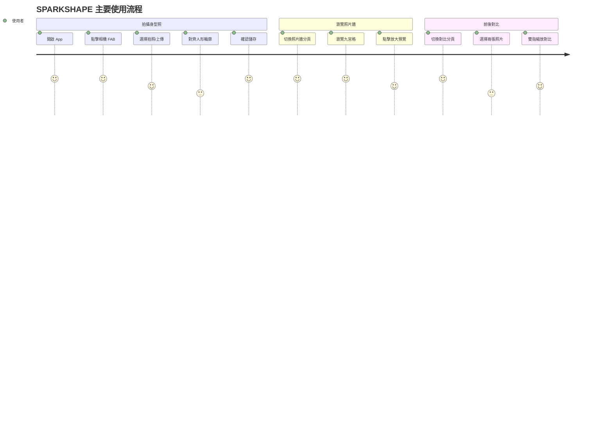

# SPARKSHAPE — 實作規格書

**日期**：2026-05-31  
**技術棧**：React Native 0.81.5 + Expo SDK ~54 + TypeScript ~5.9.2  
**架構參考**：SPARKPLATE（相同 Repo 慣例）

---

## 1. 需求重述

> 一個讓使用者能以時間軸紀錄身材外觀變化的 App，透過相機/相簿拍攝身型照（3:4 比例）、人形輪廓對齊、九宮格歷史照片牆、以及任意兩張照片的並排對比，幫助健身/體態管理者看見自己的進步。

### User Stories

| 身份 | 功能 | 目的 |
|------|------|------|
| 使用者 | 拍攝或上傳一張 3:4 身型照 | 留下今日身材紀錄 |
| 使用者 | 對齊人形輪廓後儲存照片 | 確保歷次照片取景一致，方便比較 |
| 使用者 | 在九宮格照片牆瀏覽歷史照片 | 一眼看出身材變化趨勢 |
| 使用者 | 選擇兩個時間點的照片做前後對比 | 量化感受身材進步幅度 |
| 使用者 | 雙指縮放對比照片 | 仔細觀察局部細節 |

### Acceptance Criteria

```gherkin
Scenario: 拍攝並儲存身型照
  Given 使用者在「目前身材」頁
  When 點擊右下角相機 FAB
  And 選擇「拍照」並完成拍攝（3:4 比例）
  And 在對齊畫面調整位置後點擊「確認」
  Then 照片儲存至本機
  And 「目前身材」頁更新顯示最新照片

Scenario: 照片牆顯示歷史紀錄
  Given 使用者已有多張身型照
  When 切換到「照片牆」分頁
  Then 以九宮格展示所有照片（最新在前）
  And 點擊任一張可放大預覽並顯示日期

Scenario: 前後對比
  Given 使用者在「身型對比」頁
  When 點擊「選擇照片」並從清單選取兩張不同日期的照片
  Then 左右並排展示兩張照片
  And 顯示各自日期與時間差
  And 可用雙指捏合縮放

Scenario: 首次啟動權限請求
  Given 使用者首次使用 App
  When App 啟動
  Then 在需要相機/相簿時依序請求對應權限
  And 拒絕後顯示引導說明
```

---

## 2. 架構設計

### 資料流（單向，沿用 SPARKPLATE 慣例）

```
SQLite (expo-sqlite)
  └─ src/services/bodyPhotoService.ts   純函式，接受 db 參數
       └─ src/hooks/useBodyPhotos.ts    useState + useCallback，提供 reload()
            └─ app/(tabs)/*.tsx          UI 消費 hooks
```

### 狀態分層

| 層級 | 工具 | 用途 |
|------|------|------|
| 伺服器狀態 | expo-sqlite + custom hooks | BodyPhoto 資料庫資料 |
| 全域 UI 狀態 | Zustand (`stores/`) | 對比頁選取的照片、Modal 觸發信號 |
| 本機元件狀態 | useState | 相機開啟、對齊縮放值、Sheet 狀態 |
| 設定持久化 | AsyncStorage | 照片排序偏好 |

### User Journey



### 照片多尺寸儲存（沿用 SPARKPLATE 規格）

| 尺寸 | 用途 | 最大寬高 | 壓縮品質 |
|------|------|---------|---------|
| `thumb` | 縮圖（九宮格） | 120×120 | 0.80 |
| `grid` | 格狀牆 | 400×400 | 0.85 |
| `detail` | 大圖預覽 | 800×800 | 0.90 |
| `full` | 對比頁原圖 | 1080×1440 | 0.90 |

路徑：`documentDirectory/body_photos/{photoId}/{size}.jpg`

---

## 3. 專案結構

```
SPARKSHAPE/
├── app/
│   ├── _layout.tsx              # Root Layout（DBProvider + Stack）
│   ├── index.tsx                # 重導向至 (tabs)/current
│   └── (tabs)/
│       ├── _layout.tsx          # Tab Layout（3 分頁）
│       ├── current.tsx          # 目前身材
│       ├── wall.tsx             # 照片牆
│       └── comparison.tsx       # 身型對比
├── src/
│   ├── components/
│   │   ├── BodyPhotoCard.tsx    # 九宮格單格元件
│   │   ├── SilhouetteOverlay.tsx  # 人形輪廓疊層
│   │   ├── CameraSheet.tsx      # 相機/上傳選擇 Sheet
│   │   ├── AlignScreen.tsx      # 人形對齊畫面
│   │   ├── PhotoPreviewModal.tsx # 大圖預覽
│   │   └── ComparisonPanel.tsx  # 並排對比面板
│   ├── constants/
│   │   ├── db.ts                # DB_NAME, TABLE 名稱
│   │   └── photo.ts             # PHOTO_SIZES, ASPECT_RATIO
│   ├── hooks/
│   │   └── useBodyPhotos.ts     # CRUD + reload()
│   ├── providers/
│   │   └── DBProvider.tsx       # SQLite 初始化 Context
│   ├── services/
│   │   ├── bodyPhotoService.ts  # DB CRUD 純函式
│   │   └── photoStorageService.ts # 檔案存寫、多尺寸壓縮
│   ├── stores/
│   │   └── comparisonStore.ts   # Zustand：對比選取的兩張照片
│   ├── types/
│   │   └── bodyPhoto.ts         # BodyPhoto interface
│   └── __tests__/
│       ├── services/bodyPhotoService.test.ts
│       ├── services/photoStorageService.test.ts
│       ├── hooks/useBodyPhotos.test.ts
│       └── components/
│           ├── BodyPhotoCard.test.tsx
│           └── ComparisonPanel.test.tsx
├── assets/
│   └── images/
│       └── silhouette.png       # 人形輪廓（半透明 PNG）
├── __mocks__/
│   ├── expo-camera.ts
│   ├── expo-image-picker.ts
│   └── expo-sqlite.ts
├── app.json
├── tsconfig.json
└── package.json
```

---

## 4. 資料模型

```typescript
// src/types/bodyPhoto.ts
export interface BodyPhoto {
  id: string;           // UUID
  takenAt: string;      // ISO 8601：'YYYY-MM-DDTHH:mm:ss.sssZ'
  note: string | null;
  thumbPath: string;    // 本機路徑
  gridPath: string;
  detailPath: string;
  fullPath: string;
}
```

### SQLite Schema

```sql
CREATE TABLE IF NOT EXISTS body_photos (
  id        TEXT PRIMARY KEY,
  taken_at  TEXT NOT NULL,
  note      TEXT,
  thumb_path  TEXT NOT NULL,
  grid_path   TEXT NOT NULL,
  detail_path TEXT NOT NULL,
  full_path   TEXT NOT NULL
);
```

---

## 5. 核心套件

| 套件 | 用途 |
|------|------|
| `expo-camera` ~17 | 內建相機拍攝 |
| `expo-image-picker` ~17 | 相簿選取照片 |
| `expo-image-manipulator` ~14 | 壓縮/裁切多尺寸 |
| `expo-file-system` ~19 | 本機檔案讀寫 |
| `expo-sqlite` ~16 | 本機資料庫 |
| `expo-media-library` ~17 | 儲存到裝置相簿 |
| `zustand` ^5 | 全域狀態 |
| `@react-native-async-storage/async-storage` | 設定持久化 |
| `react-native-gesture-handler` ~2.28 | Pan + Pinch 手勢 |
| `react-native-reanimated` ~4.1 | 流暢動畫 |
| `@shopify/flash-list` 2.0.2 | 高效能九宮格列表 |

> 所有套件版本已在 README.md 定義，無需另外引入新套件。

---

## 6. 實作階段

### Phase 0 — 專案初始化（Config only，免 TDD）

建立可執行的 Expo 專案骨架。

```bash
npx create-expo-app@latest SPARKSHAPE --template blank-typescript
npx expo install expo-camera expo-image-picker expo-image-manipulator \
  expo-file-system expo-sqlite expo-media-library \
  zustand @react-native-async-storage/async-storage \
  react-native-gesture-handler react-native-reanimated \
  @shopify/flash-list
```

關鍵設定：
- `app.json`：portrait only、newArchEnabled: true、androidEdgeToEdge: true、typedRoutes: true
- `tsconfig.json`：strict: true、`@/*` → `./src/*`
- `_layout.tsx`：`GestureHandlerRootView` + `DBProvider`

驗證：`npx expo start --clear` 可看到空白畫面。

---

### Phase 1 — 資料層（TDD）

#### Task 1.1 BodyPhoto 型別 & DB Schema

**RED** → 寫 `src/__tests__/services/bodyPhotoService.test.ts`，測試 `initDB`、`insertBodyPhoto`、`getAllBodyPhotos`、`deleteBodyPhoto`。  
**Verify RED**：`npm test -- bodyPhotoService` → FAIL  
**GREEN** → 建立 `src/types/bodyPhoto.ts`、`src/constants/db.ts`、`src/services/bodyPhotoService.ts`  
**Verify GREEN**：`npm test -- bodyPhotoService` → PASS  
**COMMIT**：`feat(data): add BodyPhoto SQLite service and type definitions`

Service API：
```typescript
initDB(db: SQLiteDatabase): Promise<void>
insertBodyPhoto(db, photo: Omit<BodyPhoto, 'id'>): Promise<BodyPhoto>
getAllBodyPhotos(db, order: 'asc' | 'desc'): Promise<BodyPhoto[]>
getBodyPhotoById(db, id: string): Promise<BodyPhoto | null>
deleteBodyPhoto(db, id: string): Promise<void>
```

#### Task 1.2 Photo Storage Service

**RED** → 寫 `src/__tests__/services/photoStorageService.test.ts`，mock `expo-file-system` & `expo-image-manipulator`，測試四尺寸路徑回傳與刪除行為。  
**Verify RED** → FAIL  
**GREEN** → 建立 `src/services/photoStorageService.ts`、`src/constants/photo.ts`（`PHOTO_SIZES`）  
**Verify GREEN** → PASS  
**COMMIT**：`feat(data): add photo storage service with multi-size compression`

#### Task 1.3 DBProvider & useBodyPhotos Hook

**RED** → 寫 `src/__tests__/hooks/useBodyPhotos.test.ts`，測試 `photos`、`loading`、`reload()`、`addPhoto()`、`removePhoto()`。  
**Verify RED** → FAIL  
**GREEN** → 建立 `src/providers/DBProvider.tsx`、`src/hooks/useBodyPhotos.ts`  
**Verify GREEN** → PASS  
**COMMIT**：`feat(data): add DBProvider and useBodyPhotos hook`

---

### Phase 2 — 導覽 Shell

三分頁底部導覽（目前身材 / 照片牆 / 身型對比）+ 左右滑動切換。

關鍵檔案：
- `app/_layout.tsx`：`Stack` + `DBProvider`
- `app/(tabs)/_layout.tsx`：`Tabs` with 三個 `Tabs.Screen`
- `app/(tabs)/current.tsx`、`wall.tsx`、`comparison.tsx`：placeholder

**COMMIT**：`feat(nav): add three-tab shell with bottom navigation`

---

### Phase 3 — 目前身材頁

#### Task 3.1 SilhouetteOverlay
半透明人形 PNG 疊層元件（opacity: 0.4）。  
**COMMIT**：`feat(ui): add SilhouetteOverlay component`

#### Task 3.2 AlignScreen
全螢幕照片 + 人形疊層，Pan + Pinch 手勢對齊，確認/取消按鈕。  
實作：`GestureDetector`（Pan + Pinch Composed）+ `useAnimatedStyle`（Reanimated）  
**COMMIT**：`feat(ui): add AlignScreen with gesture-based silhouette alignment`

#### Task 3.3 CameraSheet & 拍攝流程
FAB → Sheet（拍照 / 從相簿選取）→ AlignScreen → 儲存 DB + 檔案 → reload  
- `expo-camera`：`ratio="3:4"`
- `expo-image-picker`：`aspect: [3, 4]`
- `useCameraPermissions()` 守門

**COMMIT**：`feat(current): implement camera capture and align-save flow`

#### Task 3.4 CurrentBodyPage UI
- 有照片：全螢幕顯示最新 `detail` 圖 + 右下角 FAB
- 無照片：空狀態引導 + FAB

**COMMIT**：`feat(current): complete CurrentBody page with latest photo display`

---

### Phase 4 — 照片牆頁

#### Task 4.1 BodyPhotoCard
`thumb` 尺寸圖片 + 日期標籤，點擊觸發 `onPress`。  
**COMMIT**：`feat(ui): add BodyPhotoCard component`

#### Task 4.2 PhotoWallPage
`FlashList`（numColumns: 3）+ 點擊開啟 `PhotoPreviewModal`（`detail` + 日期 + 全螢幕 InteractiveViewer）  
**COMMIT**：`feat(wall): implement photo wall with 3-column grid and preview modal`

---

### Phase 5 — 身型對比頁

#### Task 5.1 Comparison Store
Zustand store：`setLeftPhoto`、`setRightPhoto`、`clearComparison`  
**COMMIT**：`feat(data): add comparison store for selected photo pair`

#### Task 5.2 ComparisonPanel
左右並排兩個 `InteractiveViewer`（minScale: 0.5、maxScale: 5.0），各自獨立 transform state，日期標籤 + 時間差。  
**COMMIT**：`feat(ui): add ComparisonPanel with interactive zoom support`

#### Task 5.3 ComparisonPage
空狀態 → 底部 Sheet 分別選取左右照片 → `ComparisonPanel`  
**COMMIT**：`feat(comparison): implement body comparison page with photo selection sheet`

---

### Phase 6 — 整合 & 收尾

- 主題：`src/constants/theme.ts`，深色健身風格，Material 3
- 空狀態元件（`EmptyState`）+ 權限拒絕引導
- 更新 `docs/tech.md` 為 React Native + Expo 正確技術棧

**COMMIT**：`feat(theme): apply dark fitness theme and finalize UX polish`

---

## 7. 驗證方式

```bash
npx tsc --noEmit              # 型別檢查
npm run test:coverage         # 測試 + 覆蓋率
npx expo start --clear        # 開發伺服器
npx expo run:android --variant release  # Release APK
```

E2E 手動驗證清單：
1. 首次啟動 → 相機/相簿權限請求
2. 拍照 → 對齊確認 → 目前身材更新
3. 照片牆顯示新照片 → 點擊放大
4. 對比頁選兩張不同日期照片 → 並排 → 雙指縮放

---

## 8. 風險與緩解

| 風險 | 緩解方式 |
|------|---------|
| `expo-camera` ratio 在不同裝置不一致 | 儲存前用 `expo-image-manipulator` 強制裁切 3:4 |
| 對比頁兩個 panel 的 Pinch 互相干擾 | 每個 `InteractiveViewer` 設獨立 transform state |
| SQLite 在 Expo Go 的限制 | 使用 development build（`npx expo run:android`） |
| 人形輪廓圖版權 | 自製 SVG 轉 PNG 或使用 open-source 素材 |

---

## 9. 成功標準

- [ ] 三個分頁可正常切換（底部 Tab + 滑動）
- [ ] 拍照/上傳 → 對齊 → 儲存流程完整
- [ ] 照片牆顯示九宮格，點擊可放大
- [ ] 對比頁可選兩張照片並排，雙指縮放有效
- [ ] 所有單元 & widget 測試通過（`npm test`）
- [ ] TypeScript strict 模式無錯誤（`npx tsc --noEmit`）
- [ ] Android & iOS 皆可執行（development build）
